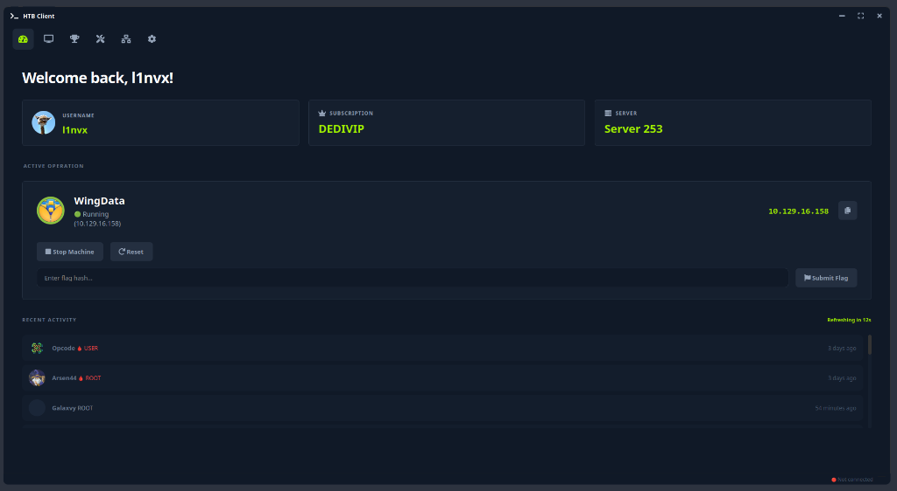
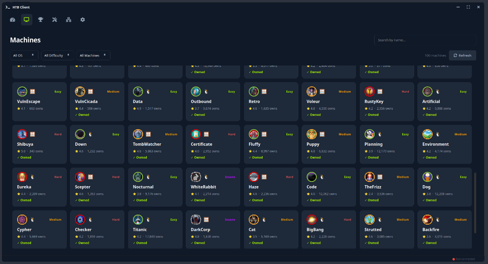
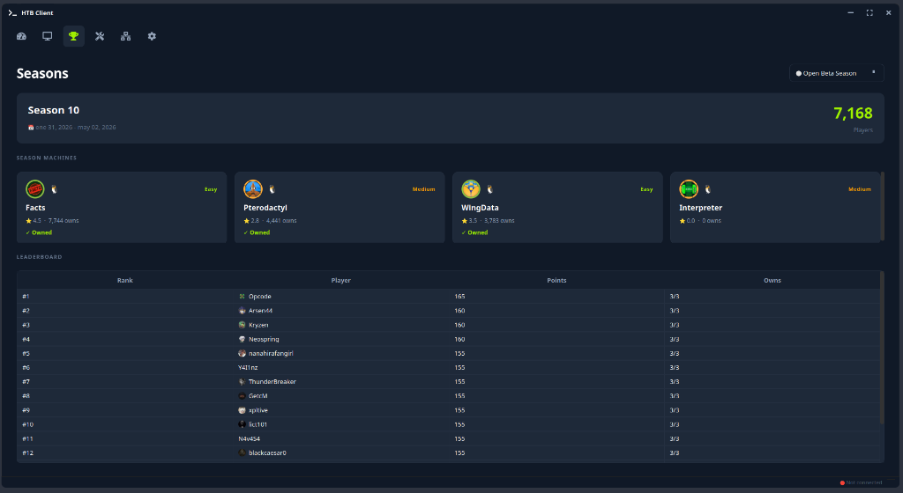
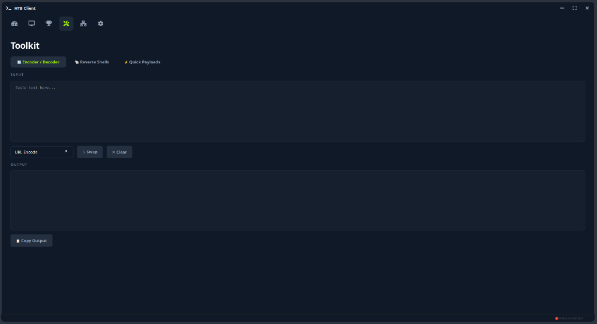
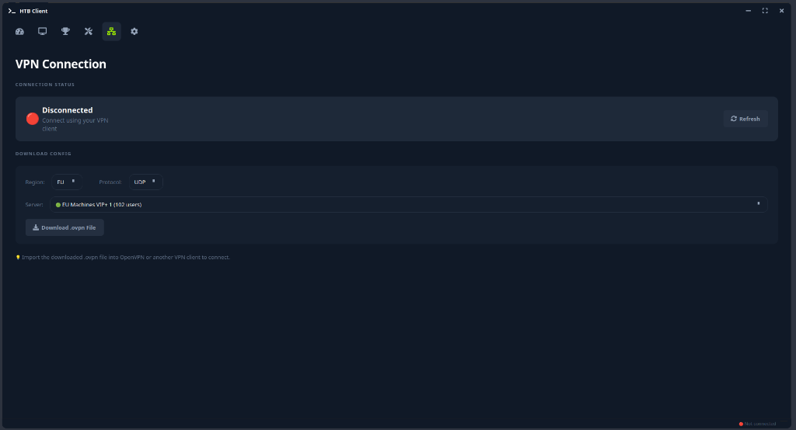

# >_ HTB Client

A modern, feature-rich **unofficial** desktop client for [HackTheBox](https://hackthebox.com) built with Python and PySide6.

> [!NOTE]
> This project is developed independently and is **not** affiliated with, endorsed by, or connected to Hack The Box.




## Features

- **Dashboard** — View your profile, active machine, and recent activity at a glance
- **Machines** — Browse, search, and filter all available machines. Spawn, reset, terminate, and submit flags
- **Seasons** — Track current season machines, leaderboard, and your progress
- **Toolkit** — Built-in encoder/decoder, reverse shell generator, and quick payloads (XSS, SQLi, SSTI, LFI, etc.)
- **VPN** — Download `.ovpn` configs directly from the app
- **Auto Spawn** — Set a timer to automatically spawn unreleased machines the moment they go live
- **Flag Watcher** — Monitors your clipboard for MD5 hashes and auto-submits flags

## Screenshots

| Machines | Seasons |
|----------|---------|
|  |  |

| Toolkit | VPN |
|---------|-----|
|  |  |

## Installation

### 1. Clone the repository
```bash
git clone https://github.com/L1nvx/htb-gui.git
cd htb-gui
```

### 2. Install dependencies
```bash
pip install -r requirements.txt
```

### 3. Configure your API token

Create a `.env` file in the project root:

```bash
cp .env.example .env
```

Edit `.env` and add your HackTheBox API token:
```
HTB_API_TOKEN=your_api_token_here
HTB_DEBUG=false
```

> Get your API token from: https://app.hackthebox.com/profile/settings

### 4. Run the application
```bash
python main.py
```

## Requirements

- Python 3.10+
- PySide6
- requests
- python-dotenv

